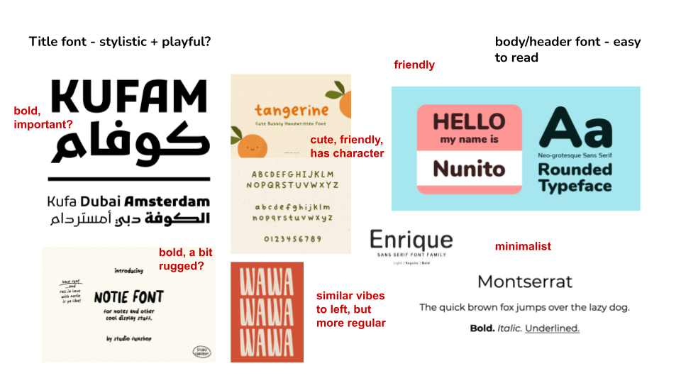

# AppReader Frontend

[Demo](https://youtu.be/B9ZNS8VYbcI)
[Backend repo](https://github.com/laureny17/appreader-backend)

## Visual Design Study

# User Journey

After logging into the webapp as an admin, the user first lands on the admin dashboard, where all active and archived events are displayed. They open “Autumn Hackathon 2025,” review its configuration settings, and add a new member to the list of verified readers. Scrolling through the flagged applications, they examine one report and decide to disqualify the applicant after confirming the issue, then unflag another after determining it was a misunderstanding. Satisfied with the event’s setup, the user switches into reader view to experience the application process firsthand. On the home page, they see their reading progress at zero and a leaderboard comparing readers’ activity and pace. Curious, they click “Start Reading” and are greeted with their first application, a progress bar marking 0/200 reads, and “[?]” icons that open the scoring rubric for clarification. They assign scores for “Passion” and “Skill,” submit the review, and watch their stats update. The next application includes a highlighted comment from another reader—a small but human touch that makes the process feel collaborative. Later, when recognizing an applicant as a close friend, they choose to “Skip” to avoid bias. By the end, they’ve explored both sides of the system: the administrative controls that keep events organized and fair, and the reader experience that makes large-scale application review transparent, communal, and ethical.
